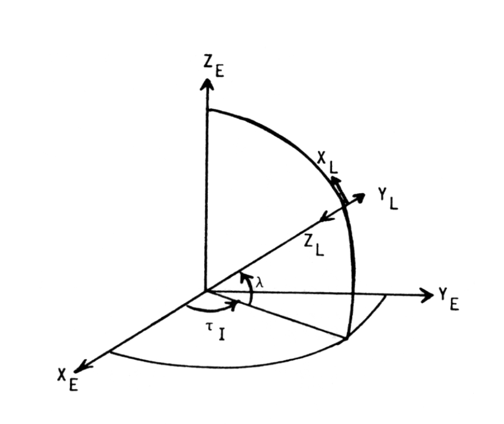
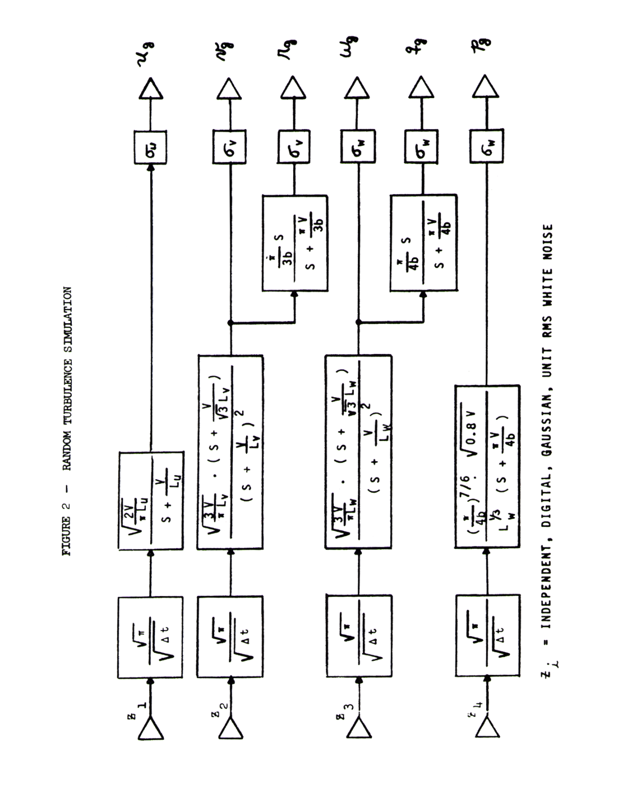
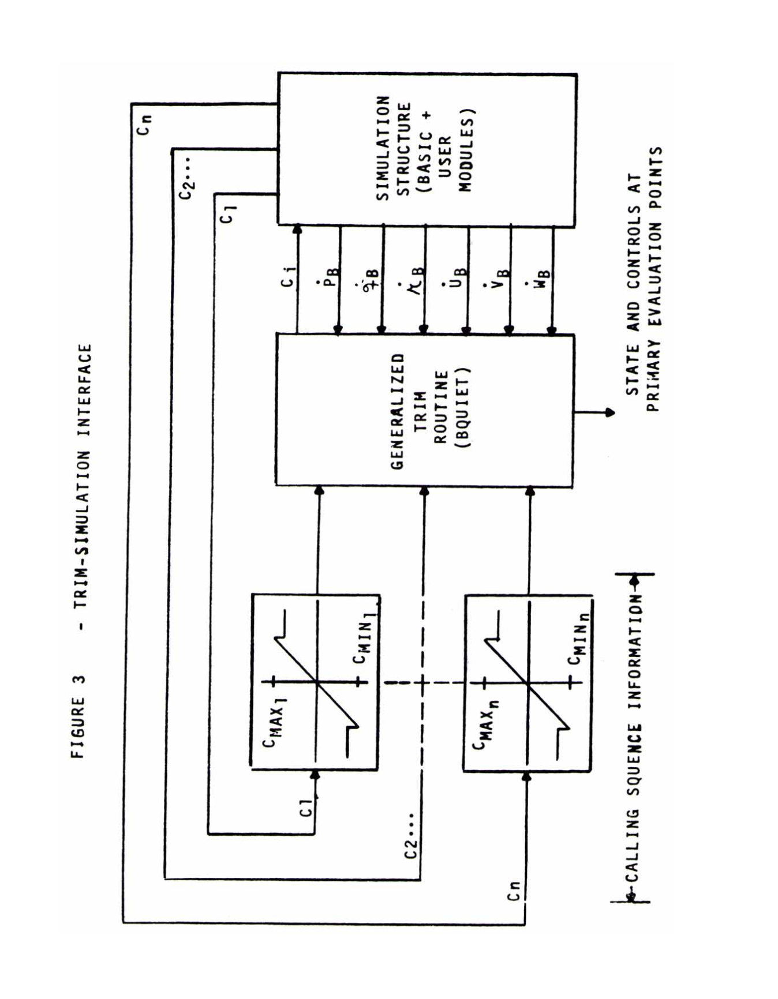
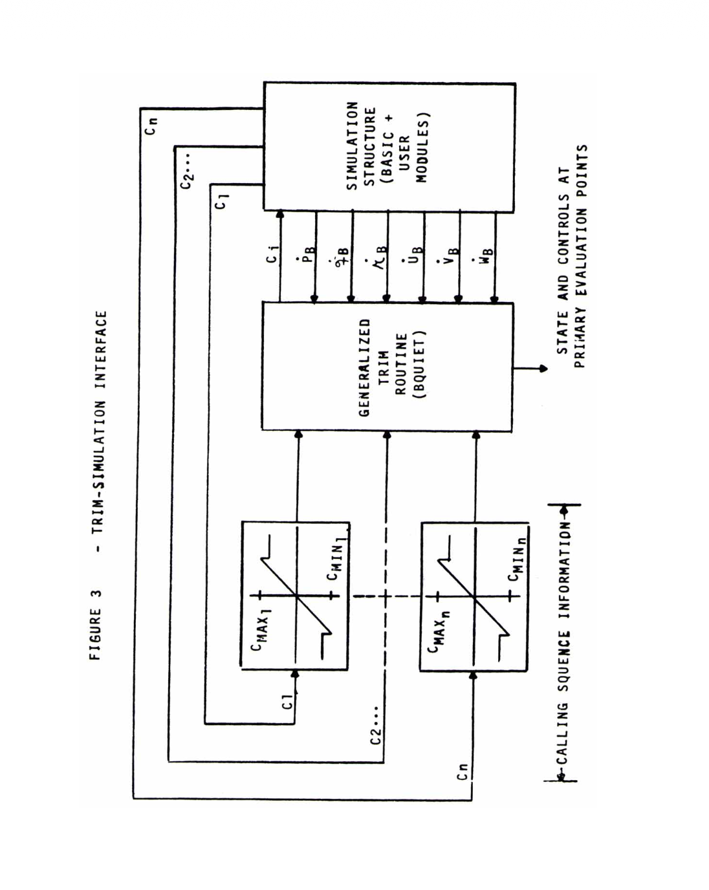

# A Standard Kinematic Model for Flight Simulation at NASA Ames

**Richard E. McFarland**  
Programs Manager  
Computer Sciences Corporation  
Mountain View, California

---

## NASA Contractor Report 2497

Prepared for  
**NASA Ames Research Center**  
Moffett Field, California

**National Aeronautics and Space Administration**  
Scientific and Technical Information Office  
1975

## Technical Report Documentation Page

**Report No.**  
NASA CR-2497

**Title and Subtitle**  
*A Standard Kinematic Model for Flight Simulation at NASA–Ames*

**Author(s)**  
Richard E. McFarland

**Performing Organization**  
Computer Sciences Corporation  
Mountain View, California

**Sponsoring Agency**  
National Aeronautics and Space Administration  
Washington, D.C. 20546

**Report Date**  
January 1975

**Type of Report**  
Contractor Report

**Contract or Grant No.**  
NAS 2-7806

---

### Abstract

A standard kinematic model for aircraft simulation exists at NASA–Ames on a
variety of computer systems, one of which is used to control the Flight
Simulator for Advanced Aircraft (FSAA). The derivation of the kinematic model
is given and various mathematical relationships are presented as a guide to
interested facility users. These include descriptions of standardized
simulation subsystems such as the atmospheric turbulence model and the
generalized six-degrees-of-freedom trim routine, as well as an introduction
to the emulative batch-processing system which enables this facility to
optimize its real-time environment.

---

### Key Words

Simulation  
Kinematic Model  
Modularized  
Turbulence  
Trim

---

**Security Classification (Report)**  
UNCLASSIFIED

**Security Classification (Page)**  
UNCLASSIFIED

**Distribution Statement**  
UNCLASSIFIED – UNLIMITED

**Number of Pages**  
44

**Price**  
$3.25

**Availability**  
For sale by the National Technical Information Service  
Springfield, Virginia 22151

---

## Table of Contents

### List of Symbols
### Summary
### 1.0 Introduction
### 2.0 Earth (E) and Local (L) Frame Relationships
### 3.0 Local (L) and Body (B) Frame Relationships
### 4.0 Velocity Vector Initialization
### 5.0 Pilot and Center of Gravity Relationships
### 6.0 Atmospheric Quantities
### 7.0 Forces and Moments
### 8.0 Landing Gear
### 9.0 Turbulence
### 10.0 Integration
### 11.0 Trimming Capability
### 12.0 Auxiliary Relationships
### 13.0 Concluding Remarks

### References

### Appendices
- Appendix A — E–L Frame Relationships
- Appendix B — Matrix Operations
- Appendix C — L–B Frame Relationships
- Appendix D — Data Handling and Analysis

---

# LIST OF SYMBOLS

| Symbol         | Description                                                                 | Units               |
|----------------|-----------------------------------------------------------------------------|---------------------|
| $\tau$       | vehicle’s longitude                                                         | rad                 |
| $\tau_I$     | vehicle’s longitude on a non-rotating earth                                 | rad                 |
| $\omega_e$   | Earth’s angular rate ($7.2685 \times 10^{-3}$)      | rad/s               |
| $t$          | time from problem start                                                      | s                   |
| $X_E, Y_E, Z_E$ | Earth-Frame (inertial) triad                                             |                     |
| $\lambda$    | vehicle’s latitude                                                          | rad                 |
| $X_L, Y_L, Z_L$ | Local-Frame triad. The vehicle remains on the $Z_L$ axis                |                     |
| $T_{E2L}$    | transformation array, reads: Earth to Local                                 |                     |
| $\Omega_L$   | first order tensor (Appendix B) consisting of elements of the Local-Frame angular rates |               |
| $p_L, q_L, r_L$ | Local-Frame angular rates about its $X_L, Y_L, Z_L$ axes respectively    | rad                 |
| $R_e$        | radius of the Earth ($20,\!898,\!908$)                                     | ft                  |
| $T_{L2E}$    | transformations used are orthogonal. Hence $T_{L2E} = T^{-1}_{E2L}$, reads Local to Earth |            |
| $h$          | vehicle altitude                                                            | ft                  |
| $R$          | distance from center of the earth to the vehicle                            | ft                  |
| $V_N, V_E, V_D$    | components of the total inertial velocity vector transformed to the Local Frame, read: North, East, Down | ft/s |
| $F_N, F_E, F_D$    | components of the applied force vector on the vehicle’s c.g. in Local-Frame space | lbs |
| $F_G$              | the force of gravity | lbs |
| $T_{L2B}$          | transformation array, reads: Local to Body | |
| $\psi, \theta, \phi$ | the Euler angles (Appendix C) relating the Local and Body Frames | rad |
| $F_{TX}, F_{TY}, F_{TZ}$ | the applied force vector in the Body-Frame | lbs |
| $m$                | vehicle mass | slugs |
| $V_{EE}$           | the vehicle’s velocity eastward over the surface of the earth. For a stationary object on the ground, this is zero | ft/s |
| $V_{NR}, V_{ER}, V_{DR}$ | relative velocity components w/r/t the air mass, in the Local Frame | ft/s |
| $V_{NW}, V_{EW}, V_{DW}$ | velocity components of the air mass in the Local Frame | ft/s |
| $U_{TURB}, \dots$  | random turbulence (zero mean) introduced in the Body Frame | ft/s |
| $U_B, V_B, W_B$    | aerodynamic velocity vector components in the Body Frame | ft/s |
| $V_{RW}$       | aerodynamic velocity magnitude                                         | ft/s         |
| $V_T$          | total velocity magnitude w/r/t earth’s surface                         | ft/s         |
| $V_G$          | ground speed                                                          | ft/s         |
| $I_{ij}$       | moments of inertia                                                    | slug-ft²     |
| $L_T, M_T, N_T$| total torque vector in the Body Frame about the $X_B, Y_B, Z_B$ axes, respectively | ft-lbs   |
| $p_B, q_B, r_B$ | Body-Frame angular rates about its $X_B, Y_B, Z_B$ axes, respectively    | rad/s     |
| $p_{LB}, q_{LB}, r_{LB}$ | Local Frame angular rates $(p_L, q_L, r_L)$ referenced to the Body Frame | rad/s    |
| $p_T, q_T, r_T$ | relative rate vector between Local and Body Frames                     | rad/s      |
| $\alpha$        | angle of attack                                                       | rad        |
| $\beta$         | sideslip angle                                                        | rad        |
| $\gamma_H$      | horizontal flight path angle measured clockwise from north (azimuth)   | rad        |
| $\gamma_V$      | flight path angle                                                     | rad        |
| $a$             | speed of sound at altitude                                            | ft/s       |
| $\rho$          | air density at altitude                                               | slug/ft³   |
| $\rho_0$        | sea level                                                              |            |
| $V_{eq}$           | equivalent airspeed                                                  | knots               |
| $a_X, a_Y, a_Z$    | Body Frame inertial acceleration components (c.g.)                  | ft/s²               |
| $\Omega_B$         | Body Frame angular rate tensor (Appendix B)                         |                     |
| $h_R$              | runway altitude                                                     | ft                  |
| $R_R$              | runway altitude plus radius of earth                                | ft                  |
| $\tau_R$           | longitude of runway                                                 | rad                 |
| $\lambda_R$        | latitude of runway                                                  | rad                 |
| $h_{CG}$           | height of vehicle above runway (c.g.)                               | ft                  |
| $\Delta N_R, \Delta E_R$ | position of vehicle north and east of the runway threshold    | ft                  |
| $X_{CG}, Y_{CG}$   | vehicle horizontal displacement down the runway and to its right     | ft                  |
| $\theta_R$         | runway heading, measured from north                                 | rad                 |
| $F_{AX}, F_{AY}, F_{AZ}$ | aerodynamic forces in Body Frame                             | lbs                 |
| $F_{EX}, F_{EY}, F_{EZ}$ | engine forces in Body Frame                                 | lbs                 |
| $F_{GX}, F_{GY}, F_{GZ}$ | gear reaction forces in Body Frame                          | lbs                 |
| $L_A, M_A, N_A$    | aerodynamic torques about Body axes                                 | ft-lbs              |
| $L_E, M_E, N_E$    | engine torques about Body axes                                      | ft-lbs              |
| $L_G, M_G, N_G$    | gear reaction torques about Body axes                                  | ft-lb               |
| $p_{TURB}, q_{TURB}, r_{TURB}$ | random angular turbulence (zero mean) introduced in Body Frame | rad/s               |
| $p_{BWN} \dots$ | $p_B \dots$ with inclusion of random angular turbulence                | rad/s               |

---

## A STANDARD KINEMATIC MODEL FOR FLIGHT SIMULATION AT NASA-AMES
by
Richard E. McFarland*

### Summary

The use of a standard kinematic model provides for effective utilization of the flight simulation facilities at NASA Ames. This paper describes the model as well as the functional relationships used in its derivation.

*Programs Manager, Computer Sciences Corporation, Mountain View,
California.

---

## 1.0 Introduction

The material in this paper constitutes the kinematic model used in the generalized aircraft simulation program structure, herein called BASIC, and additionally outlines certain standardized auxiliary simulation components such as the atmospheric and turbulence models. The kinematic model is common to all of the simulation computers at NASA Ames, and is maintained as a general computer library. Because of the diverse problem areas this model is called upon to investigate, it is extensive.

In the following development, the equations presented should not be construed as constituting either the computational load or the procedural order of the digital programs comprising BASIC. The actual computations, which accommodate multi-loop, real-time programming structures, are segmented into modules which are executed at rates based upon their relative frequency content.

The various coordinate frames used in the model have the advantage of great relative accuracy without the necessity of resorting to computationally expensive techniques such as double-precision arithmetic. Although integrations are performed in a pseudo-inertial frame with compass-directional axes, the mathematical relationships are rigorous, and resultant positional information may be used for certain navigational studies.

All axis systems used are orthogonal, right-handed triads.

---

## 2.0 Earth (E) and Local (L) Frame Relationships

The Earth Frame is the principal frame for the development of the mathematical relationships used in BASIC since, neglecting extraterrestrial considerations, it neither rotates nor translates. However, it is not an especially interesting frame in the problem of aircraft simulation, and quantities related to this frame do not appear explicitly in any of the finalized equations.

The Earth Frame is an inertial frame with the origin of coordinates at the earth’s center (spherical); the $Z_E$ axis intersects the North Pole, and the $X_E$ axis intersects the zero degree longitude line (Greenwich) at “zero time”.

The Local (L) Frame is situated on the earth’s surface, directly under the vehicle. Its $X_L$ axis points northward and its YL axis points eastward; both are paparallel to the earth’s surface. The $Z_L$ axis points towards the earth’s center. This is not an inertial frame since it follows the motion of the aircraft. Its distance from the center of the earth $R_E$, however, is constant.

The $E$ and $L$ Frames are related through the Inertial Longitude Angle $\tau_E$ and the Latitude Angle $\lambda$ as shown in Figure 1. Since the earth rotates about the $Z_E$ axis with the angular velocity ${\omega}_E$. a vehicle’s longitude $\tau$ will differ from the Inertial Longitude Angle $\tau_I$ as a function of elapsed time:

$$
\tau = \tau_I - \omega_e t
$$

The inertial latitude does not differ from that of a rotating earth.

Figure 1 Description of E-L Axes Systems

The transformation from the Earth Frame to the Local Frame (see Appendix A for the derivation) is given by

$$
[T_{E2L}] =
\begin{bmatrix}
-S\lambda \, C\tau_I & -S\lambda \, S\tau_I & C\lambda \\
-S\tau_I             & C\tau_I           & 0 \\
-C\lambda \, C\tau_I & -C\lambda \, S\tau_I & -S\lambda
\end{bmatrix}
\tag{2.2}
$$

<!-- https://quicklatex.com/cache3/52/ql_58b3079e9ef9cda06449144ee85b7352_l3.png -->

were the trigonometric functions **sine** and **cosine** will be abbreviated **S** and **C** throughout.

Since the L-frame is always under the aircraft on the Earth’s surface, the center of the L-Frame is always a distance Re (20,898,908 feet) from the center of the E-Frame, which is located at the earth’s center. The $Z_L$ always points downward (perpendicular to a sperical earth’s surface).

Whenever the aircraft translates over the earth's surface a relativerotation between the L and E Frames occurs which may be represented by the instantaneous rates $p_L, q_L, r_L$ of the L-Frame itself $X_L, Y_L, Z_L$. The omega-cross operator $Q^L$,

$$
[ \Omega_L ] =
\begin{bmatrix}
0      & -r_L & q_L \\
r_L    & 0    & -p_L \\
-q_L   & p_L  & 0
\end{bmatrix}
\tag{2.3}
$$

<!-- https://quicklatex.com/cache3/7d/ql_00aad289dd84c5510bf3c0a2e71bb77d_l3.png -->

and two identities which relate a transformation matrix to its derivative in terms of this operator,

$$
\[dot{T}_{E2L}] = -[\Omega_L][T_{E2L}]
$$

$$
\[dot{T}_{L2E}] = [T_{L2E}][\Omega_L]
\tag{2.4}
$$

<!-- https://quicklatex.com/cache3/af/ql_11d5ac1e6cd33686f6fb7f63c0a7daaf_l3.png -->

where $p_L$, $q_L$, and $r_L$ are the instantaneous angular rates of the Local frame about its $X_L$, $Y_L$, and $Z_L$ axes, respectively.

are developed in Appendix B. The second derivative follows as

$$
\ddot{[T}_{E2L}] = \{ [\Omega_L]^2 - [\dot{\Omega}_L] \} [T_{E2L}]
\tag{2.5}
$$

<!-- https://quicklatex.com/cache3/0c/ql_66f664d594a7a828e5ada8fbc89faa0c_l3.png -->

where

$$
[\dot{\Omega}_L] =
\begin{bmatrix}
0 & -\dot{r}_L & \dot{q}_L \\
\dot{r}_L & 0 & -\dot{p}_L \\
-\dot{q}_L & \dot{p}_L & 0
\end{bmatrix}
\tag{2.6}
$$

<!-- https://quicklatex.com/cache3/41/ql_0ca78315b4283f46cb72908734e76f41_l3.png -->

and

$$
\left[\Omega_L\right]^2 =
\begin{bmatrix}
-r_L^2 - q_L^2 & p_L q_L & r_L p_L \\
p_L q_L & -r_L^2 - p_L^2 & r_L q_L \\
p_L r_L & q_L r_L & -q_L^2 - p_L^2
\end{bmatrix}
\tag{2.7}
$$

<!-- https://quicklatex.com/cache3/e4/ql_e391d9c68b416c2b7eb116231ae4dce4_l3.png -->

From Appendix A, the instantaneous rates about the L-Frame may be related to the translational velocity of the aircraft over the earth’s surface by

$$
\begin{bmatrix}
p_L \\
q_L \\
r_L
\end{bmatrix} =
\begin{bmatrix}
\dot{\tau}_I \cos \lambda \\
-\dot{\lambda} \\
-\dot{\tau}_I \sin \lambda
\end{bmatrix} 
\tag{2.8}
$$

<!-- https://quicklatex.com/cache3/f9/ql_cb35d8d988eba33aad68dc29e67fe4f9_l3.png -->

This vector introduces the Coriolis effect into the model; its influence, being velocity proportional, is understandably infinitesimal for most applications. However, problems of even coarse navigation aboard an SST would suffer from its absence. The inertial position vector (E-Frame) is related to the position vector in the Local Frame by

$$
\begin{bmatrix}
X_E \\
Y_E \\
Z_E
\end{bmatrix} =
[T_{L2E}]
\begin{bmatrix}
X_L \\
Y_L \\
Z_L - R_e
\end{bmatrix} 
\tag{2.9}
$$

<!-- https://quicklatex.com/cache3/06/ql_2683eb6c1841fa28ab5e55564f0b1706_l3.png -->

where $Z_L$ is the negative of the altitude h. Taking into account the fact that $R_e$ is a constant, the inertial velocity vector is the time derivative of the above equation:

$$
\begin{bmatrix}
\dot{X}_E \\
\dot{Y}_E \\
\dot{Z}_E
\end{bmatrix} =[\dot{T}_{L2E}]
\begin{bmatrix}
X_L \\
Y_L \\
Z_L - R_e
\end{bmatrix} +
[T_{L2E}]
\begin{bmatrix}
\dot{X}_L \\
\dot{Y}_L \\
\dot{Z}_L
\end{bmatrix}
$$

$$
=[T_{L2E}]
\Bigg\{
\begin{bmatrix}
\dot{X}_L \\
\dot{Y}_L \\
\dot{Z}_L
\end{bmatrix} +
[\Omega_L]
\begin{bmatrix}
X_L \\
Y_L \\
Z_L - R_e
\end{bmatrix}
\Bigg\}
\tag{2.10}
$$

<!-- https://quicklatex.com/cache3/b1/ql_f88404e071fae2a194a43ac4dc3eb5b1_l3.png -->

However, in the L-Frame, no motion occurs from the origin of coordinates except along the $Z_L$ axis $\left( \dot{X}_L = \dot{Y}_L = 0 \right)$. Defining

$$
R = R_e - Z_L = R_e + h 
\tag{2.11}
$$

the inertial velocity vector (transformed to the instantaneous Local Frame) is

$$
\begin{bmatrix}
V_N \\
V_E \\
V_D
\end{bmatrix}
= T_{E2L}
\begin{bmatrix}
\dot{X}_E \\
\dot{Y}_E \\
\dot{Z}_E
\end{bmatrix}
=\begin{bmatrix}
0 \\
0 \\
-\dot{R}
\end{bmatrix}
+[{\Omega}_L]
\begin{bmatrix}
0 \\
0 \\
-R
\end{bmatrix}
\tag{2.12}
$$

<!-- https://quicklatex.com/cache3/3d/ql_32b7db88697f9f5c7f03699c2059b73d_l3.png -->

which, using (2.3) and (2.8) is also

$$
\begin{bmatrix}
V_N \\
V_E \\
V_D
\end{bmatrix} =\begin{bmatrix}
-R q_L \\
R p_L \\
-\dot{R}
\end{bmatrix} =\begin{bmatrix}
R \dot{\lambda} \\
R \dot{\tau}_I \cos \lambda \\
-\dot{R}
\end{bmatrix} 
\tag{2.13}
$$

<!-- https://quicklatex.com/cache3/09/ql_39e798874979fb1e3bbdc078a8b87b09_l3.png -->

From these elements, (2.8) may be rewritten

$$
\begin{bmatrix}
p_L \\
q_L \\
r_L
\end{bmatrix} =\frac{1}{R}
\begin{bmatrix}
V_E \\
-V_N \\
-V_E \tan \lambda
\end{bmatrix} 
\tag{2.14}
$$

<!-- https://quicklatex.com/cache3/46/ql_1e37f6c987fc392f5078bc69e6f24846_l3.png -->

The inverse radius factor reiterates the argument that this vector generally
has a very small magnitude.

The inertial acceleration vector is the time derivative of the inertial
velocity vector (2.10).

$$
\begin{bmatrix}
\ddot{X}_E \\
\ddot{Y}_E \\
\ddot{Z}_E
\end{bmatrix} =
[\ddot{T}_{L2E}]
\begin{bmatrix}
X_L \\
Y_L \\
Z_L
\end{bmatrix} +
2[\dot{T}_{L2E}]
\begin{bmatrix}
\dot{X}_L \\
\dot{Y}_L \\
\dot{Z}_L
\end{bmatrix} +
[T_{L2E}]
\begin{bmatrix}
\ddot{X}_L \\
\ddot{Y}_L \\
\ddot{Z}_L
\end{bmatrix}
$$

$$
=[T_{L2E}]
\left\{
\begin{bmatrix}
\ddot{X}_L \\
\ddot{Y}_L \\
\ddot{Z}_L
\end{bmatrix}
+2[\Omega_L]
\begin{bmatrix}
\dot{X}_L \\
\dot{Y}_L \\
\dot{Z}_L
\end{bmatrix}
+\left( [\Omega_L]^2 + [\dot{\Omega}_L] \right)
\begin{bmatrix}
X_L \\
Y_L \\
Z_L - R_e
\end{bmatrix}
\right\}
\tag{2.15}
$$

<!-- https://quicklatex.com/cache3/2a/ql_733aeb76486987350e831e134ce6502a_l3.png -->

and again, since motion occurs only along the $Z_L$ axis,

$$
\begin{bmatrix}
\ddot{X}_E \\
\ddot{Y}_E \\
\ddot{Z}_E
\end{bmatrix} 
=[T_{L2E}]
\Bigg\{
\begin{bmatrix}
0 \\
0 \\
-\ddot{R}
\end{bmatrix}
+2[\Omega_L]
\begin{bmatrix}
0 \\
0 \\
-\dot{R}
\end{bmatrix}
+\left( [\Omega_L]^2 +[\dot{\Omega}_L] \right)
\begin{bmatrix}
0 \\
0 \\
-R
\end{bmatrix}
\Bigg\}
\tag{2.16}
$$

<!-- https://quicklatex.com/cache3/f7/ql_9cf0e2c8e6fb3d2f293c769063598df7_l3.png -->

This is the inertial acceleration vector, and as such, may be transformed to the Local Frame and equated to the total acceleration vector (both applied and field forces considered)

$$
[T_{E2L}]
\begin{bmatrix}
\ddot{X}_E \\
\ddot{Y}_E \\
\ddot{Z}_E
\end{bmatrix} =\frac{1}{m}
\begin{bmatrix}
F_N \\
F_E \\
F_D
\end{bmatrix}+
\frac{1}{m}
\begin{bmatrix}
0 \\
0 \\
F_G
\end{bmatrix} 
\tag{2.17}
$$

<!-- https://quicklatex.com/cache3/54/ql_fe97fa20d95b97ab5bd7b0078ec62d54_l3.png -->

where the force of gravity is related to the sea level weight W or gravita-
tional acceleration $$g_o$$ by

$$
F_G = W \left( \frac{R_e}{R} \right)^2 = m g_o \left( \frac{R_e}{R} \right)^2
\tag{2.18}
$$

<!-- https://quicklatex.com/cache3/fb/ql_b8bf861c0093b9afe540fb736602fffb_l3.png -->

## 3.0 Local (L) and Body (B) Frame Relationships

The Body frame uses conventional aircraft notation: the $X_B$ axis passes through the nose of the vehicle, the $Y_B$ axis points toward the right wing, and the $Z_B$ axis passes through the bottom of the vehicle. The Body frame origin is located at the vehicle center of gravity.

The transformation matrix from the Local frame to the Body frame, $[T_{L2B}]$, is an identity matrix whenever the aircraft is parallel to the Earth’s surface (horizontal) and pointing northward. From Appendix C,

$$
[T_{L2B}]=
\begin{bmatrix}
C\theta C\psi & C\theta S\psi & -S\theta \\
S\phi S\theta C\psi - C\phi S\psi &
S\phi S\theta S\psi + C\phi C\psi &
S\phi C\theta \\
C\phi S\theta C\psi + S\phi S\psi &
C\phi S\theta S\psi - S\phi C\psi &
C\phi C\theta
\end{bmatrix} 
\tag{3.1}
$$

<!-- https://quicklatex.com/cache3/18/ql_028b8b8f895ee69173b2b926a560fd18_l3.png -->

Forces applied in the Body frame may be represented in the Local frame by the inverse (or transpose) relationship

$$
\begin{bmatrix}
F_N \\
F_E \\
F_D
\end{bmatrix} =[T_{L2E}]^{-1}
\begin{bmatrix}
F_{TX} \\
F_{TY} \\
F_{TZ}
\end{bmatrix} 
\tag{3.2}
$$

<!-- https://quicklatex.com/cache3/0e/ql_437b41dc5307d4e30693df5444ea420e_l3.png -->

and with the addition of the field force, this is proportional to the inertial acceleration vector (2.16), transformed to the Local frame (see (2.14) and (2.17))

$$
\frac{1}{m}
\begin{bmatrix}
F_N \\
F_E \\
F_D +F_G
\end{bmatrix} =\begin{bmatrix}
-2 q_L \dot{R} - r_L p_L R - \dot{q}_L R \\
2 p_L \dot{R} - r_L q_L R + \dot{p}_L R \\
-\ddot{R} + (q_L^2 + p_L^2) R
\end{bmatrix} 
\tag{3.3}
$$

<!-- https://quicklatex.com/cache3/6f/ql_8e34b6d871e3ccbe5e0d0641a3a7c46f_l3.png -->

The derivative of the components of (2.14), with substitutions from (2.13),

$$
\begin{bmatrix}
\dot{p}_L \\
\dot{q}_L
\end{bmatrix} =\frac{1}{R}
\begin{bmatrix}
\dot{V}_E+V_D p_L \\
-\dot{V}_N+V_D q_L
\end{bmatrix} 
\tag{3.4}
$$

<!-- https://quicklatex.com/cache3/ef/ql_64af9f577c9a3e8fb7240f5d48e977ef_l3.png -->

When substituted into (3.3), this produces the Local-frame force vector. This illustrates the individual contributions due to Coriolis and centripetal accelerations, as well as the applied and field forces.

$$
\frac{1}{m}
\begin{bmatrix}
F_N \\
F_E \\
F_D + F_G
\end{bmatrix} =\begin{bmatrix}
q_L V_D - r_L p_L R + \dot{V}_N \\
-p_L V_D - r_L q_L R + \dot{V}_E \\
(q_L^2 + p_L^2) R + \dot{V}_D
\end{bmatrix} 
\tag{3.5}
$$

<!-- https://quicklatex.com/cache3/b6/ql_5dfff21128eb9560807d882f41cb35b6_l3.png -->

By substitutions from (2.14), this equation is used to obtain the time differential of the inertial velocity vector transformed to the instantaneous Local Frame:

$$
\begin{bmatrix}
\dot{V}_N \\
\dot{V}_E \\
\dot{V}_D
\end{bmatrix} =\frac{1}{m}
\begin{bmatrix}
F_N \\
F_E \\
F_D + F_G
\end{bmatrix}
\begin{bmatrix}
-q_L V_D + r_L p_L R \\
\;\; p_L V_D + r_L q_L R \\
-(q_L^2 + p_L^2) R
\end{bmatrix}
$$

$$
=\frac{1}{m}
\begin{bmatrix}
F_N \\
F_E \\
F_D + F_G
\end{bmatrix} +
\frac{1}{R}
\begin{bmatrix}
V_N V_D - V_E^2 \tan \lambda \\
V_E V_D + V_N V_E \tan \lambda \\
-(V_N^2 + V_E^2)
\end{bmatrix} 
\tag{3.6}
$$

<!-- https://quicklatex.com/cache3/d6/ql_5c9edd8c74daaef34a717400e86ab7d6_l3.png -->

These accelerations are integrated to form the Local-frame velocity vector, and this integration includes the effects of both the Earth’s rotation and rotations produced by vehicle translation.

$$
\begin{bmatrix}
V_N \\
V_E \\
V_D
\end{bmatrix} =\int
\begin{bmatrix}
\dot{V}_N \\
\dot{V}_E \\
\dot{V}_D
\end{bmatrix}
\, dt 
\tag{3.7}
$$

<!-- https://quicklatex.com/cache3/fe/ql_90cee5d79ed4c7d53934bcf3c490b8fe_l3.png -->

The velocity integration employs the second-order Adams–Bashforth method. To obtain the Local-frame velocity of the vehicle relative to the Earth’s surface, subtract the velocity component arising from the Earth’s rotation $(\omega_e)$ about the $Z_E$ axis from the previously computed velocity:

$$
\begin{bmatrix}
V_N \\
V_E \\
V_D
\end{bmatrix} =\begin{bmatrix}
V_N \\
V_E \\
V_D
\end{bmatrix} -
\omega_e
\begin{bmatrix}
0 & \sin\lambda & 0 \\
-\sin\lambda & 0 & -\cos\lambda \\
0 & \cos\lambda & 0
\end{bmatrix}
\begin{bmatrix}
0 \\
0 \\
R
\end{bmatrix}
$$

$$
\hspace{5cm}
=\begin{bmatrix}
V_N \\
V_E \\
V_D
\end{bmatrix} -
\omega_e R \cos\lambda
\begin{bmatrix}
0 \\
1 \\
0
\end{bmatrix} 
\tag{3.8}
$$

<!-- https://quicklatex.com/cache3/0c/ql_4a5cc62fa131c6b036c122aed7a1310c_l3.png -->

Only the eastward component is influenced.

Not to be confused with a “north wind”, which emanates from the north; in BASIC terminology a “velocity north” heads northward (if positive), etc.
The total wind vector is treated as a random variable with both a trend and random component, represented by

$$
\begin{bmatrix}
V_{TWN} \\
V_{TWE} \\
V_{TWD}
\end{bmatrix} =\begin{bmatrix}
V_{NW} \\
V_{EW} \\
V_{DW}
\end{bmatrix} +
\begin{bmatrix}
V_{NTURB} \\
V_{ETURB} \\
V_{DTURB}
\end{bmatrix} 
\tag{3.9}
$$

<!-- https://quicklatex.com/cache3/b0/ql_7a1ade3e0da35b8d65cbfb6ae035d7b0_l3.png -->

in which the random portion may originate in the Body Frame, as in

$$
\begin{bmatrix}
V_{NTURB} \\
V_{ETURB} \\
V_{DTURB}
\end{bmatrix}= [T_{B2L}]
\begin{bmatrix}
U_{TURB} \\
V_{TURB} \\
W_{TURB}
\end{bmatrix} 
\tag{3.10}
$$

<!-- https://quicklatex.com/cache3/e4/ql_4fa538388f1b8ab93427a0274ebdede4_l3.png -->

The aerodynamic velocity vector is then the difference between the vehicle velocity with respect to the earth’s surface and the total velocity of the air mass with respect to the earth’s surface

$$
\begin{bmatrix}
V_{NR} \\
V_{ER} \\
V_{DR}
\end{bmatrix} =\begin{bmatrix}
V_{N} \\
V_{E} \\
V_{D}
\end{bmatrix} -
\begin{bmatrix}
V_{TWN} \\
V_{TWE} \\
V_{TWD}
\end{bmatrix} 
\tag{3.11}
$$

<!-- https://quicklatex.com/cache3/f1/ql_6d6f5c5ed6edcff5e6f81c7fb4295141_l3.png -->

In the Body frame this is expressed as

$$
\begin{bmatrix}
U_B \\
V_B \\
W_B
\end{bmatrix} =[T_{L2B}]
\begin{bmatrix}
V_{NR} \\
V_{ER} \\
V_{DR}
\end{bmatrix} 
\tag{3.12}
$$

<!-- https://quicklatex.com/cache3/b0/ql_26e818d5b42652f596a0751ebbaf20b0_l3.png -->

with resultant magnitude

$$
V_{BK} = \sqrt{U_B^2 + V_B^2 + W_B^2} = \sqrt{V_{NR}^2 + V_{ER}^2 + V_{DR}^2} 
\tag{3.13}
$$

<!-- https://quicklatex.com/cache3/bb/ql_49beab88ce3005c1fcf3d50ad72120bb_l3.png -->

which is not to be confused with the earth-relative velocity magnitude

$$
V_T = \sqrt{V_N^2 + V_{EE}^2 + V_D^2} 
\tag{3.14}
$$

<!-- https://quicklatex.com/cache3/24/ql_34367574bcf4135274a65722ce94b124_l3.png -->

or the ground speed

$$
V_G = \sqrt{V_N^2 + V_{EE}^2} 
\tag{3.15}
$$

<!-- https://quicklatex.com/cache3/f6/ql_c0a7f55584ff8fe5b4cfdc5630a928f6_l3.png -->

The Body-axis acceleration vector is the derivative of (3.12) (see Appendix B and (3.25)),

$$
\begin{bmatrix}
\dot{U}_B \\
\dot{V}_B \\
\dot{W}_B
\end{bmatrix} =-
\begin{bmatrix}
0 & -r_T & q_T \\
r_T & 0 & -p_T \\
-q_T & p_T & 0
\end{bmatrix}
\begin{bmatrix}
U_B \\
V_B \\
W_B
\end{bmatrix} +
[T_{L2B}]
\begin{bmatrix}
\dot{V}_N - \dot{V}_{TWN} \\
\dot{V}_E - \dot{V}_{TWE} \\
\dot{V}_D - \dot{V}_{TWD}
\end{bmatrix} 
\tag{3.16}
$$

<!-- https://quicklatex.com/cache3/b5/ql_2ff89266e27d97de9125c08f70d3ddb5_l3.png -->

In Section 9.0, however, it is shown that the turbulence model develops disturbances in velocity space only, and the differentiation of random variables to obtain pseudo-acceleration terms for $V_{TWN}, V_{TWE}, V_{TWD}$ is not an attractive discrete operation. Furthermore, within the BASIC system the vector $(U_B, V_B, W_B)$ is an open-loop calculation with the following two exceptions: 

1. During the initial-condition trim process (see Section 11.0), in which random components are necessarily eliminated.
2. In the computation of the angles of attack and sideslip, $\alpha$ and $\beta$ (see (3.31) and (3.32)), which are seldom-used variables; the introduction of turbulence into these terms is best left to the discretion of researchers. For these reasons, the random elements of (3.16) are suppressed by use of the approximation

$$
\begin{bmatrix}
\dot{V}_N - \dot{V}_{TWN} \\
\dot{V}_E - \dot{V}_{TWE} \\
\dot{V}_D - \dot{V}_{TWD}
\end{bmatrix} =\begin{bmatrix}
\dot{V}_N - \dot{V}_{WN} \\
\dot{V}_E - \dot{V}_{WE} \\
\dot{V}_D - \dot{V}_{WD}
\end{bmatrix} 
\tag{3.17}
$$

<!-- https://quicklatex.com/cache3/3c/ql_9a55dcf22cabadab8a1038b83221243c_l3.png -->

 which includes only acceleration terms of the “trend” of the wind profile. Finite differences are adequate for this computation.

Equation (3.16) is verified by [1]; notice that the integration of (3.16) in the reference frame (B), which may have a high rotational velocity, is judiciously avoided by use of (3.7). This approach is basically that developed by L. E. Fogarty and R. M. Howe in early publications on “Analog Computer Solution of the Orbital Flight Equations”.

The rate of change in longitude over a rotating Earth is equal to the inertial rate of change due to translation about the $Z_E$ axis, minus the Earth's own rotation rate (derivative of (2.1)), such that (2.13) may be rewritten

$$
\begin{bmatrix}
V_N \\
V_E \\
V_D
\end{bmatrix} =\begin{bmatrix}
R \dot{\lambda} \\
R \dot{\tau}_I \cos \lambda \\
-\dot{R}
\end{bmatrix} +
R \omega_e \cos \lambda
\begin{bmatrix}
0 \\
1 \\
0
\end{bmatrix} 
\tag{3.18}
$$

<!-- https://quicklatex.com/cache3/70/ql_deeaa655366f44fd9b7f07f040e9fd70_l3.png -->

And by comparison with (3.8),

$$
\begin{bmatrix}
\dot{\tau} \\
\dot{\lambda}
\end{bmatrix} =\frac{1}{R}
\begin{bmatrix}
V_{EE} / \cos \lambda \\
V_N
\end{bmatrix} 
\tag{3.19}
$$

<!-- https://quicklatex.com/cache3/4c/ql_65064f65809ea0c8ce6afcc17c1bf04c_l3.png -->

where $\tau$ is the vehicle longitude and $\lambda$ is the latitude. A direct integration, with appropriate initial conditions, produces the position vector

$$
\begin{bmatrix}
\tau \\
\lambda \\
h
\end{bmatrix} =\int
\begin{bmatrix}
\dot{\tau} \\
\dot{\lambda} \\
\dot{h}
\end{bmatrix} 
\tag{3.20}
$$

<!-- https://quicklatex.com/cache3/29/ql_539d77a7eec19e041681fc76c19ce729_l3.png -->

which determines tne position of the vehicle with respect to the surface of a spherical, rotating earth. This integration is performed with the trapezoidal algorithm.

By assuming that the $X_B$–$Z_B$ plane is a plane of symmetry, the Euler moment equations [2] may be written

$$
\begin{aligned}
    L_T &= \dot{p}_B I_{XX} + q_B r_B (I_{ZZ} - I_{YY}) - (\dot{r}_B + p_B q_B) I_{XZ} \\
    M_T &= \dot{q}_B I_{YY} + p_B r_B (I_{XX} - I_{ZZ}) - (r_B^2 - p_B^2) I_{XZ} \\
    N_T &= \dot{r}_B I_{ZZ} + p_B q_B (I_{YY} - I_{XX}) - (\dot{p}_B - q_B r_B) I_{XZ}
\end{aligned} 
\tag{3.21}
$$

<!-- https://quicklatex.com/cache3/15/ql_7ef4448f44d5fc75e60c150ce4930e15_l3.png -->

By simultaneous solution the angular acceleration couple in these equations may be eliminated. The resultant form of Euler’s Dynamical Equations is

$$
\begin{bmatrix}
\dot{p}_B \\
\dot{q}_B \\
\dot{r}_B
\end{bmatrix} =\begin{bmatrix}
(C_1 r_B + C_2 p_B) q_B \\
C_5 r_B p_B + C_6 (r_B^2 - p_B^2) \\
(C_8 p_B + C_9 r_B) q_B
\end{bmatrix} +
\begin{bmatrix}
C_3 & 0   & C_4 \\
0   & C_7 & 0   \\
C_4 & 0   & C_{10}
\end{bmatrix}
\begin{bmatrix}
L_T \\
M_T \\
N_T
\end{bmatrix} 
\tag{3.22}
$$

<!-- https://quicklatex.com/cache3/56/ql_eb63045e64919240f911e04cf19fba56_l3.png  -->

in which the coefficents have been computed in the following order:

$$
\begin{bmatrix}
C_0 \\
C_1 \\
C_2 \\
C_3 \\
C_4 \\
C_5 \\
C_6 \\
C_7 \\
C_8 \\
C_9 \\
C_{10}
\end{bmatrix} =\begin{bmatrix}
(I_{XX} I_{ZZ} - I_{XZ}^2)^{-1} \\
C_0 \{ (I_{YY} - I_{ZZ}) I_{ZZ} - I_{XZ}^2 \} \\
C_0 I_{XZ} (I_{XX} - I_{YY} + I_{ZZ}) \\
C_0 I_{ZZ} \\
C_0 I_{XZ} \\
I_{YY}^{-1} \\
C_0 (I_{ZZ} - I_{XX}) \\
C_1 I_{XZ} \\
C_0 \{ (I_{XX} - I_{YY}) I_{XX} + I_{XZ}^2 \} \\
C_0 I_{XZ} (I_{YY} - I_{ZZ} - I_{XX}) \\
C_0 I_{XX}
\end{bmatrix} 
\tag{3.23}
$$

<!-- https://quicklatex.com/cache3/ea/ql_5455b7014f4f5897d5a6cdb661e38bea_l3.png -->

The moments of inertia, and hence these coefficients, are usually designated as constant for simulations in which there is no concern with real-time variations in either mass or center-of-gravity.

This fact, however, does not restrict BASIC to either the selected principal axes or the stationary coefficient assumptions. BASIC’s highly modularized form permits easy access to (and replacement of) groups of equations such as these.

The Body-frame angular rates are gained through the integration of (3.22) by use of the second-order Adams–Bashforth algorithm.

$$
\begin{bmatrix}
p_B \\
q_B \\
r_B
\end{bmatrix} =\int
\begin{bmatrix}
\dot{p}_B \\
\dot{q}_B \\
\dot{r}_B
\end{bmatrix}
\, dt 
\tag{3.24}
$$

<!-- https://quicklatex.com/cache3/34/ql_fb6af1bb39a83b1aed545fdca291ae34_l3.png -->

The rotation of the L-Frame, using (2.14), is referenced to the Body frame through the transformation

$$
\begin{bmatrix}
p_{LB} \\
q_{LB} \\
r_{LB}
\end{bmatrix} =[T_{L2B}]
\begin{bmatrix}
p_L \\
q_L \\
r_L
\end{bmatrix} 
\tag{3.25}
$$

<!-- https://quicklatex.com/cache3/90/ql_855e2e26ea6939db06ddf8103eb7be90_l3.png -->

 and the difference between this rate vector and that resulting from the applied torques in the Body frame produces the differences in orientation of the Local and Body frames.

$$
\begin{bmatrix}
p_T \\
q_T \\
r_T
\end{bmatrix} =\begin{bmatrix}
p_B \\
q_B \\
r_B
\end{bmatrix} -
\begin{bmatrix}
p_{LB} \\
q_{LB} \\
r_{LB}
\end{bmatrix} 
\tag{3.26}
$$

<!-- https://quicklatex.com/cache3/d7/ql_facd6f0e9a0b343e4de9c8ed36276cd7_l3.png -->

This equation is therefore used to produce the angular-rate differences, which in turn are used to create the Euler sequence rates (see Appendix C). The Euler angle sequence must be specified. In BASIC it is assumed (in transforming from the Local frame to the Body frame) that the sequence order is (1) yaw, (2) pitch and then (3) roll.

$$
\begin{bmatrix}
\dot{\psi} \\
\dot{\theta} \\
\dot{\phi}
\end{bmatrix} =\begin{bmatrix}
\frac{q_T \sin\phi + r_T \cos\phi}{\cos\theta} \\
q_T \cos\phi - r_T \sin\phi \\
p_T + \dot{\psi} \sin\theta
\end{bmatrix} 
\tag{3.27}
$$

<!-- https://quicklatex.com/cache3/ef/ql_f15b866b8d8e8e13d6b73c3715f890ef_l3.png -->

The Euler angles which relate the Body (B) frame to the Local (L) frame, in the specified sequence, are computed from the relative angular-rate vector $p_T$, $q_T$, $r_T$ using the trapezoidal algorithm.

$$
\begin{bmatrix}
\psi \\
\theta \\
\phi
\end{bmatrix} =\int
\begin{bmatrix}
\dot{\psi} \\
\dot{\theta} \\
\dot{\phi}
\end{bmatrix}
\, dt 
\tag{3.28}
$$

<!-- https://quicklatex.com/cache3/c3/ql_5fe2e147f17a5bce8f7d6754326652c3_l3.png -->

Special programming considerations permit the simulation of hovering and rearward flight. The angles of attack and sideslip are

$$
\alpha = \tan^{-1} \left( \frac{W_u}{U_u} \right) \qquad \left( -\frac{\pi}{2} < \alpha < \frac{\pi}{2} \right) 
\tag{3.29}
$$

$$
\beta = \tan^{-1} \left( \frac{V_{u}}{\sqrt{U_{u}^2 + W_{u}^2}} \right) 
\qquad \left( -\pi < \beta < \pi \right) 
\tag{3.30}
$$

<!-- https://quicklatex.com/cache3/f7/ql_db2e7a6d411993d1f26982c210e097f7_l3.png -->

in which j is unity, with the sign of $U_B$. The rates of change in these quantities are

$$
\dot{\alpha} =
\frac{U_u \dot{W}_u - W_u \dot{U}_u}
     {U_u^2 + W_u^2} 
\tag{3.31}
$$

//
$$
\dot{\beta} =
\frac{j}{
    V_{u}^2 \sqrt{U_{u}^2 + W_{u}^2}
}
\left[
    (U_{u}^2 + W_{u}^2)\dot{V}_{u}
    - V_{u}(U_{u}\dot{U}_{u} + W_{u}\dot{W}_{u})
\right] 
\tag{3.32}
$$

<!-- https://quicklatex.com/cache3/5a/ql_f37ec913671d9d1089a02ba97c4bf15a_l3.png -->

---

## 4.0 Velocity Vector Initialization
The total velocity with respect to the Earth’s surface may be described in terms of pointing angles which have no aerodynamic relationship whatsoever:

$$
\begin{bmatrix}
V_N \\
V_{EE} \\
V_D
\end{bmatrix} =V_T
\begin{bmatrix}
\cos \gamma_V \cos \gamma_H \\
\cos \gamma_V \sin \gamma_H \\
-\sin \gamma_V
\end{bmatrix} 
\tag{4.1}
$$

<!-- https://quicklatex.com/cache3/cf/ql_6c4d593fc89959c9a4b4976bde125bcf_l3.png -->

Velocity initialization in BASIC is the simultaneous satisfaction of the constraints of (4.1), regarding the direction of the total velocity vector, and the selected aerodynamic velocity magnitude given by one of the two options described:

$$
V_{RW} = 
\begin{cases}
V_{0} \cdot a & \text{(option 1)} \\
\dfrac{V_{0}}{0.592485 \sqrt{\dfrac{\rho}{\rho_{0}}}} & \text{(option 2)}
\end{cases} 
\tag{4.2}
$$

<!-- https://quicklatex.com/cache3/89/ql_bfc622e5ea63c94bd0288051e8bc0989_l3.png -->

With the first option, $V_0$ is used as an input Mach number which is multiplied by the speed of sound (at altitude). With the second option, $V_0$ is used as the initial equivalent airspeed in units of knots; combining the appropriate conversion factor and the indicated function of atmospheric density ratio, this also results in the aerodynamic velocity $V_{RW}$.

The equivalent airspeed is

$$
V_{eq}
=0.592485 \, V_{RW} \sqrt{\frac{\rho}{\rho_0}} 
\tag{4.3}
$$

<!-- https://quicklatex.com/cache3/e0/ql_1616b82a219018a88e88151ebe6f27e0_l3.png -->

It should be noticed that the aerodynamic velocity magnitude is that which is specified regardless of the magnitude or direction of an arbitrary wind profile. In addition, the initialization procedure also requires the specification of the __direction__ $\gamma_H$ and $\gamma_V$ of the __total__ velocity vector.

Initialization of a vehicle on the ground is handled differently. Equation (4.1) is solved directly with the assumption that the taxi speed is the input $V_o$ (it replaces $V_T$).

---

## 5.0 Pilot and Center of Gravity Relationships

The position and acceleration of both the pilot’s station and the center of gravity are computed in BASIC for reasons which include the control of visual and motion simulators.

The Body-frame inertial acceleration of the center of gravity (which would be sensed by accelerometers placed there) relates to the applied forces proportionally as

$$
\begin{bmatrix}
a_X \\
a_Y \\
a_Z
\end{bmatrix} =\frac{1}{m}
\begin{bmatrix}
F_{TX} \\
F_{TY} \\
F_{TZ}
\end{bmatrix} 
\tag{5.1}
$$

<!-- https://quicklatex.com/cache3/39/ql_3263509427545c7d6857341f257d0439_l3.png -->

such that at the pilot’s station the sensed accelerations are

$$
\begin{aligned}
\begin{bmatrix}
a_{XP} \\
a_{YP} \\
a_{ZP}
\end{bmatrix}
&=
\begin{bmatrix}
a_X \\
a_Y \\
a_Z
\end{bmatrix} +
\left(
[\Omega_B]^2 +
[\dot{\Omega}_B]
\right)
\begin{bmatrix}
X_P \\
Y_P \\
Z_P
\end{bmatrix}
\end{aligned} +
\begin{aligned}
2[\Omega_B]
\begin{bmatrix}
\dot{X}_P \\
\dot{Y}_P \\
\dot{Z}_P
\end{bmatrix} +
\begin{bmatrix}
\ddot{X}_P \\
\ddot{Y}_P \\
\ddot{Z}_P
\end{bmatrix}
\end{aligned} 
\tag{5.2}
$$

<!-- https://quicklatex.com/cache3/8e/ql_f6175f0ad5a231061181f5fdc46cfc8e_l3.png -->

where, as in (2.3) et al,

$$
[\Omega_B] =
\begin{bmatrix}
0    & -r_b & q_b \\
r_b  & 0    & -p_b \\
-q_b & p_b  & 0 
\end{bmatrix} 
\tag{5.3}
$$

<!-- https://quicklatex.com/cache3/7a/ql_bb64dfbac5039fb8d2ee9745f53a5c7a_l3.png -->

The position vector $X_P, Y_P, Z_P$ relates the pilot station to the center of gravity in the Body Frame; its derivatives are generally zero.

By specifying the runway parameters: longitude $\tau_R$, latitude $\lambda_R$, height above sea level $h_R$, and clockwise direction with respect to North $\theta_R$, the radius from the center of the Earth to the runway is

$$
R_R = R_e + h_R 
\tag{5.4}
$$

<!-- https://quicklatex.com/cache3/6f/ql_f79fc9182dcf3a696813434c5c7bc26f_l3.png -->

The center of gravity of the vehicle is located north, east, and above the runway according to

$$
\begin{bmatrix}
\Delta N_{R} \\
\Delta E_{R} \\
h_{CG}
\end{bmatrix} =R_{R}
\begin{bmatrix}
\lambda - \lambda_{R} \\
(\tau - \tau_{R}) \cos \lambda_{R} \\
0
\end{bmatrix}
\begin{bmatrix}
0 \\
0 \\
h - h_{R}
\end{bmatrix} 
\tag{5.5}
$$

<!-- https://quicklatex.com/cache3/d6/ql_dd323132dfa03fdac1323f174c14a3d6_l3.png -->

In terms of the Runway frame, which is defined with the $x$-axis “down” the runway and the $y$-axis “to the right”, with origin at the threshold, the center-of-gravity position is further amplified:

$$
\begin{bmatrix}
X_{CG} \\
Y_{CG}
\end{bmatrix} =\begin{bmatrix}
\cos \theta_R & \sin \theta_R \\
-\sin \theta_R & \cos \theta_R
\end{bmatrix}
\begin{bmatrix}
\Delta N_R \\
\Delta E_R
\end{bmatrix} 
\tag{5.6}
$$

<!-- https://quicklatex.com/cache3/e1/ql_a4055904cd1ed46c89852ff5e44a2be1_l3.png -->

The pilot’s station is related to the runway by

$$
\begin{bmatrix}
\Delta N_{PR} \\
\Delta E_{PR} \\
-H_{PR}
\end{bmatrix} =\begin{bmatrix}
\Delta N_R \\
\Delta E_R \\
-h_{CG}
\end{bmatrix} +
[T_{L2B}]^{-1}
\begin{bmatrix}
X_P \\
Y_P \\
Z_P
\end{bmatrix} 
\tag{5.7}
$$

<!-- https://quicklatex.com/cache3/08/ql_76b60a8329f113904890609f5a8cb708_l3.png -->

$$
\begin{bmatrix}
X_{PR} \\
Y_{PR}
\end{bmatrix} =\begin{bmatrix}
\cos \theta_R & \sin \theta_R \\
-\sin \theta_R & \cos \theta_R
\end{bmatrix}
\begin{bmatrix}
\Delta N_{PR} \\
\Delta E_{PR}
\end{bmatrix} 
\tag{5.8}
$$

<!-- https://quicklatex.com/cache3/b2/ql_9eed1a7175637d3b7d4d1024f91bffb2_l3.png -->

Equations (5.5) through (5.8) are “flat-earth” approximations which are only valid in the vicinity of the runway.

---

## 6.0 Atmospheric Quantities

BASIC provides many typical atmospheric-related quantities; some examples
appear below.

The total temperature ratio is related to the Mach number by

$$
T_R = 1 + 0.2 M^2 
\tag{6.1}
$$

<!-- https://quicklatex.com/cache3/01/ql_faa8970b1db9ed932f6f5c1725727801_l3.png -->

If the velocity is subsonic, the total pressure ratio is

$$
PR = (TR)^{7/2} 
\tag{6.2}
$$

<!-- https://quicklatex.com/cache3/9d/ql_5af83f881cbcfe28b73522f44403d49d_l3.png -->

but if it is supersonic it is

$$
P_R =
\frac{(166.9)M^2}
     {(7 - M^{-2})^{5/2}} 
\tag{6.3}
$$

<!-- https://quicklatex.com/cache3/e1/ql_b2ca29bfc8de37f30ef922d2bed4a5e1_l3.png -->

These two expressions are equal if M=1. Below an altitude of $h = 36{,}089$ feet, the ambient temperature and pressure ratios are given by

$$
T_{AR} = 1 - 6.875 \times 10^{-6} \, h
$$

$$
P_{AR} = T_{AR}5.256 
\tag{6.4}
$$

<!-- https://quicklatex.com/cache3/a5/ql_70376065adefe81f31e72fc37dea32a5_l3.png -->

Above this altitude they are

$$
T_{AR} =0.751895
$$

$$
P_{AR} =0.2234 \, e^{-4.806 \times 10^{-5}(h - 36089)} 
\tag{6.5}
$$

<!-- https://quicklatex.com/cache3/dd/ql_72b107cd184f8e02a40de5600bf248dd_l3.png -->

The ambient temperature (°C) has provision for an incremental temperature and is given by

$$
T_A
=\Delta T_A +
T_{AP}
\left(
\frac{518.69}{1.8}
\right) 
\tag{6.5}
$$

<!-- https://quicklatex.com/cache3/6f/ql_0a87740860e1105829d90090d8efbc6f_l3.png -->

The ambient pressure is

$$
P_A
=(2116.2) \, P_{AR} 
\tag{6.6}
$$

<!-- https://quicklatex.com/cache3/92/ql_e034d66a2901087beae8d477abde2992_l3.png -->

The total temperature and pressure are

$$
T_T = T_R \, T_A 
\tag{6.7}
$$

$$
P_T = P_R \, P_A 
\tag{6.8}
$$

<!-- https://quicklatex.com/cache3/6d/ql_533232e61477afa91e040d2c5d7afa6d_l3.png -->

and the impact pressure is

$$
\bar{q}_C = P_T - P_A 
\tag{6.9}
$$

<!-- https://quicklatex.com/cache3/e9/ql_f2f88115ba2ec76e94c5ea49bb7729e9_l3.png -->

---

BASIC utilizes the 1962 ARDC tables for atmospheric density $\rho$ and the speed of sound $a$, both as functions of altitude $h$ up to 240,000 feet, with data points every 2,000 feet. Optionally, a constant
relationship may be selected.

The atmospheric density and speed of sound may be modified by delta-temperature effects as follows:

$$
\rho = \rho_{\text{TABLE}} \frac{(T_A - \Delta T_A)}{T_A}
$$

$$
a = a_{\text{TABLE}} \sqrt{\frac{T_A}{T_A - \Delta T_A}} 
\tag{6.10}
$$

<!-- https://quicklatex.com/cache3/45/ql_84b1d49dd6be07dba1d2a06ccaccb645_l3.png -->

and the calibrated airspeed is computed from

$$
V_C = (0.592485) \, a_0 \sqrt{5 \left[ \left(1 + \frac{\bar{q}_C}{2116.2}\right)^{2.8537} - 1 \right]} 
\tag{6.12}
$$

<!-- https://quicklatex.com/cache3/2f/ql_2e2d80a0d1407ba3c1e278b39504c42f_l3.png -->

where $a_0$ is the speed of sound at sea level.

---

## 7.0 Forces and Moments

The atmospheric and other quantities shown above are generally useful to BASIC users for utilization by their Engine and Aerodynamic modules. These modules, together with the total landing gear influence, are then used to produce the total applied forces and moments used in (3.2) and (3.21), respectively.

The total force, applied at the vehicle center of gravity and with all components transformed to the Body Frame, consists of aerodynamic, engine, and gear contributions (discussed in Section 8.0):

$$
\begin{bmatrix}
F_{TX} \\
F_{TY} \\
F_{TZ}
\end{bmatrix} =\begin{bmatrix}
F_{AX} \\
F_{AY} \\
F_{AZ}
\end{bmatrix} +
\begin{bmatrix}
F_{EX} \\
F_{EY} \\
F_{EZ}
\end{bmatrix} +
\begin{bmatrix}
F_{GX} \\
F_{GY} \\
F_{GZ}
\end{bmatrix} 
\tag{7.1}
$$

<!-- https://quicklatex.com/cache3/1a/ql_14c8115721eb9907072db9843ae9151a_l3.png -->

Contributions to the moments about the vehicle center of gravity in the Body Frame are computed from the same sources as are the forces.

$$
\begin{bmatrix}
L_T \\
L_T \\
L_T
\end{bmatrix} =\begin{bmatrix}
L_{A} \\
M_{A} \\
N_{A}
\end{bmatrix} +
\begin{bmatrix}
L_{E} \\
M_{E} \\
N_{E}
\end{bmatrix} +
\begin{bmatrix}
L_{G} \\
M_{G} \\
N_{G}
\end{bmatrix} 
\tag{7.2}
$$

<!-- https://quicklatex.com/cache3/c0/ql_e3ddfa7a9569063b14072af5c33a7cc0_l3.png -->

This over-simplified structure is designed only for modular isolation of components, especially in program-debug mode; additional contributions to forces and moments are of course permitted.

---

## 8.0 Landing Gear

The user is provided (from BASIC) the values of compression and stroke rate of each gear and is expected to return to BASIC values for oleo force $F_O$, friction force $F_F$, and side force $F_S$.
The modeling of these forces is the user’s responsibility. They usually involve considerations of static loading, damping, braking, and steering.

The height of a selected position near the tail of the aircraft is also monitored 

$$
h_T = h_{CG} + X_T \sin \theta - Z_T \cos \theta 
\tag{8.1}
$$

<!-- https://quicklatex.com/cache3/0d/ql_bf2210cf63e1324a32ecc6575648d70d_l3.png -->

to determine whether or not the ground has been intercepted. If so, the vertical velocity of intersection is

$$
\dot{h}_T = \dot{h} + \dot{\theta} ( X_T \cos \theta - Z_T \sin \theta ) 
\tag{8.2}
$$

<!-- https://quicklatex.com/cache3/19/ql_85097c77f91e2a38d346010e9f741219_l3.png -->

Each landing gear is monitored by use of various elements in the $[T_{L2B}]$ array of Appendix C 

$$
h_{q_i} =
\left[ h_{CG}
-T_{13} X_{G_1}
-T_{23} Y_{G_1}
-T_{33} Z_{G_1}
\right] / T_{33} 
\tag{8.3}
$$

<!-- https://quicklatex.com/cache3/0a/ql_70a71f61178d3ffc20560e9f20886a0a_l3.png -->

A negative component denotes that the particular gear is on the ground. Its rate of compression is computed with a difference equation. Also, a program “flag” is set 

$$
N_{G_1} =
\begin{cases}
0, & \text{gear not on ground} \\
1, & \text{gear on ground}
\end{cases} 
\tag{8.4}
$$

for event-marker indication, landing gear lights, etc.

With the above information the user’s Gear Routine provides the necessary forces for the equations

$$
F_{Rx_i} = F_{R_i} - F_{L_i} \, \theta
$$

$$
F_{Ry_i} = F_{L_i} \, \phi + F_{S_i}
$$

$$
F_{Ry_i} = F_{L_i} + F_{R_i} \sin \theta - F_{S_i} \sin \phi 
\tag{...}
$$

<!-- https://quicklatex.com/cache3/cb/ql_fda7feaf0bb96735cab542284c87facb_l3.png -->

Additionally, a tail reaction force $F_{TR}$ and friction force $F_{TF}$ may be developed from (8.1) and (8.2).

$$
\begin{aligned}
L_G &= \sum \left[ F_{RZ_i} Y_{G_i} - F_{RY_i} (h_{q_i} + Z_{G_i}) \right] \\[1.5ex]
M_G &= -X_T F_{TR} + \sum \left[ F_{RX_i} (h_{q_i} + Z_{G_i}) - F_{RZ_i} X_{G_i} \right] \\[1.5ex]
N_G &= \sum \left[ F_{RY_i} X_{G_i} - F_{RX_i} Y_{G_i} \right]
\end{aligned} 
\tag{8.6}
$$

<!-- https://quicklatex.com/cache3/c2/ql_57942a83215b7b2c567b24ac1ea414c2_l3.png -->

The gear contributions to the total moments, including tail impact, are

$$
\begin{bmatrix}
F_{GX} \\
F_{GY} \\
F_{GZ}
\end{bmatrix} =\begin{bmatrix}
F_{TF} \\
0 \\
F_{TR}
\end{bmatrix} +
\sum
\begin{bmatrix}
F_{RX_i} \\
F_{RY_i} \\
F_{RZ_i}
\end{bmatrix} 
\tag{8.7}
$$

<!-- https://quicklatex.com/cache3/98/ql_6f287b245b2c8f888d0366f21ae47698_l3.png -->

The subscript $i$ runs from one to three which corresponds to the nose, right, and left landing gear, respectively.

---

## 9.0 Turbulence

As in the case of aerodynamic velocity turbulence (see (3.10)),
computations are also made for angular velocity disturbances.
The resultant variables are not, however, used in the angular
acceleration computations, but rather are simply made available
to the user for inclusion in aerodynamic coefficient buildup
equations [3].

The angular velocity components are

$$
\begin{bmatrix}
p_{BWN} \\
q_{BWN} \\
r_{BWN}
\end{bmatrix} =\begin{bmatrix}
p_{B} \\
q_{B} \\
r_{B}
\end{bmatrix} +
\begin{bmatrix}
p_{TURB} \\
q_{TURB} \\
r_{TURB}
\end{bmatrix} 
\tag{9.1}
$$

<!-- https://quicklatex.com/cache3/0e/ql_05650e387079f839f66809820527930e_l3.png -->

Figure (2) is a Laplace diagram of how four separate digital white-noise sources $Z_i$ may be filtered to produce aircraft disturbances conforming to the Dryden spectra model. The sample-data correction is shown along with the continuous equivalent of what is actually simulated using Z-transforms
with a zero-order hold.

Parameters are supplied by the user and consist of the wing span $b$, the characteristic lengths $L_U, L_V, L_W$, and the dispersions $\sigma_U, \sigma_V, \sigma_W$.

This digital model is based upon the original work of Neuman and Foster [4] of NASA and has since gained applicability to a wide range of aircraft configurations. Certain mainframe manufacturers have their own versions of this model, notably Boeing; their analysis concludes that they have produced
filters which “match the Von Karman PSD’s for $\omega < 10 \,\text{rad/s}$”.

This model is also available within BASIC. It is noteworthy that the techniques utilized call for the introduction of turbulence effects in the Earth frame rather than the Body frame.

---

## 10.0 Integration

The equations of state given in (3.7), (3.20), (3.23), and (3.27) are integrated in BASIC by use of the second-order Adams–Bashforth predictor and the trapezoidal algorithm, which are given by

$$
\dot{y}_{n+1}=
\dot{y}_n
+\left( 3 \dot{y}_n - \dot{y}_{n-1} \right) \frac{\Delta t}{2}
\qquad \text{(Adams–Bashforth 2nd)} 
\tag{10.1}
$$

$$
y_{n+1}=
y_n
+\left( \dot{y}_n + \dot{y}_{n+1} \right) \frac{\Delta t}{2}
\qquad \text{(trapezoidal)}
$$

<!-- https://quicklatex.com/cache3/9b/ql_b8809916a5034124cb73c186eef5a79b_l3.png -->

The selected integration algorithms (and their interaction) have undergone an extensive phase and magnitude analysis (in the total system environment) over forcing function frequencies of up to a few hertz. This was accomplished by the comparison of non-real-time segments computed with unity-millisecond cycle times to segments obtained by use of realistic cycle times
in the tens-of-milliseconds range.

> **Figure 2 — Dryden Turbulence Model (Digital Implementation)**  
>  
> Block diagram illustrating the generation of aircraft turbulence
> disturbances from independent, unit-variance Gaussian white-noise sources
> \( Z_i \). Each channel is filtered to match the Dryden power spectral
> density, using a digital realization with zero-order hold.  
>  
> The model produces translational turbulence components
> \( (u_g, v_g, w_g) \) and angular-rate disturbances
> \( (p_g, q_g, r_g) \), which are made available for aerodynamic coefficient
> buildup but are not directly injected into the rigid-body angular
> acceleration equations.  
>  
> *Source: McFarland, “A Standard Kinematic Model for Flight Simulation at
> NASA–Ames”, NASA CR-2497.*

Arbitrary transfer functions are usually simulated with constant-cycle-time state-space techniques such as Z-transforms. A general technique, which we call SOLACE, has the advantage that on-line changes may be made to the coefficient structure and system form.

This system, which utilizes matrix exponentiation techniques with either a zero- or first-order hold, will generally give the real-time solution to the following stationary system [5]

$$
y = 
\left[
\frac{
B_{m+1} S^{n} + B_n S^{m-1} + \cdots + B_1
}{
C_{n+1} S^{n} + C_n S^{n-1} + \cdots + C_1
}
\right] x
\qquad (10.2)
$$

<!-- https://quicklatex.com/cache3/1e/ql_e7cbe42a2e1ad9acb00b3dd93c601e1e_l3.png -->

 with a computation overhead equivalent to the multiplication of an $m \times n$ matrix and an $n$-vector.

---

## 11.0 Trimming Capability

A routine which drives the state vector $\dot{p}_B,\, \dot{q}_B,\, \dot{r}_B,\, \dot{U}_B,\, \dot{V}_B,\, \dot{W}_B$ to zero by appropriate manipulation of an arbitrary set of controls (up to six) is fully integrated into the BASIC structure.

The routine uses classical techniques of regression analysis and acts as a forcing function to the entire simulation rather than to subsets thereof. This process is indicated in Figure 3.

Automatic features of the system include a process which senses that the vehicle is on the ground, ignores the normal control list, and performs a weight-on-wheels trim which takes the gear geometry into account.

Asymmetrical flight conditions do not pose any problems to the six-degrees-of-freedom trim routine (called **BQUIET**), provided that the steady-state solution exists within the aircraft’s data map and control
deflection extrema.

---

## 12.0 Auxiliary Relationships

The standard aircraft simulation model includes many “canned” relationships which accrue to each facility user. They result in instrument drives, indicator lights, event markers, strip-chart displays, localizer and
glide-slope signals, and other computations which include:

(a) Outer and middle marker events resulting from the vehicle being within a vertical cone emanating from selected positions.

> **Figure 3 — Trim–Simulation Interface (BQUIET)**  
>  
> Block diagram illustrating the interaction between the generalized trim
> routine (**BQUIET**) and the main simulation loop. The trim algorithm drives
> the selected state variables—typically
> \( (p_B, q_B, r_B, U_B, V_B, W_B) \)—toward zero by iteratively adjusting a
> bounded set of control inputs \( C_1 \ldots C_n \).  
>  
> Control deflections are constrained by minimum and maximum limits
> (\( C_{\min}, C_{\max} \)), and the trim process operates as a global forcing
> function acting on the entire simulation rather than on isolated subsystems.
> Primary evaluation points feed back into the trim logic until convergence is
> achieved or limits are reached.  
>  
> *Source: McFarland, “A Standard Kinematic Model for Flight Simulation at
> NASA–Ames”, NASA CR-2497.*

(b) Altitude “trips”, resultant from the wheels being below:

1. 1500 feet  
2. 200 feet  
3. The flare height (pre-set constant)  
4. A selected height (pilot variable)

(c) Thrust asymmetry computations resulting in event-marker indicators,

(d) Automatic strip-chart speed control as a function of altitude and computer mode, and automatic strip-chart run-number identification and calibration after each run, and

(e) Landing-gear transit delays and discretes.

---

## 13.0 Concluding Remarks

In order to utilize BASIC it is generally required that the user furnish the information necessary to program modules (subprograms) which “fill in the blanks”. This minimally consists of functional curves and tabulations, geometrical considerations, schematics for the control system and engine characteristics, aerodynamic coefficient buildup equations, other data, and at least the gear static loading curves.

Then, in a pseudo–closed-shop environment, programmer-analysts ascertain the correct frequency-domain division of labor, allocate special COMMON symbols, program the modules, link them to all BASIC COMMON symbols, interface the program to the simulation facility, perform static and dynamic checks, and
assist the project engineers in the gathering of data, its interpretation and reduction, and in the expansion and elaboration of the simulation capability.

It is, of course, an integral part of this process that the research goals be published at project initiation.

> **Figure 4 — Off-Line (Batch) Executive Routine**  
>  
> Block diagram of the batch-processing executive routine used in the
> non-real-time version of BASIC. This executive supplants the real-time
> simulation controller and enables off-line debugging, all-digital data
> acquisition, and post-processing analysis on the NASA-Ames IBM-360 system.  
>  
> Aircraft-specific configuration data are supplied through standardized
> plug-in modules, allowing programs developed off-line to be transferred
> directly (in source form) to the real-time simulation computers without
> structural modification.  
>  
> The off-line executive supports extensive COMMON data handling, analysis,
> and instrumentation capabilities, as further described in Appendix D.  
>  
> *Source: McFarland, “A Standard Kinematic Model for Flight Simulation at
> NASA–Ames”, NASA CR-2497.*

## References

1. **Connolly, M. E.**  
   *Simulation of Aircraft*, NAVTRADEVCEN 7591-R-1, February 1958, p. 55.

2. **Becker, R. A.**  
   *Introduction to Theoretical Mechanics*, McGraw-Hill, New York, 1954,  
   pp. 274, 290–291.

3. **Chalk, C. R.; Neal, T. P.; Harris, T. M.; Pritchard, F. E.; Woodcock, R. J.**  
   *Background Information and User Guide for MIL-F-8785B (ASG):  
   “Military Specification – Flying Qualities of Piloted Airplanes”*,  
   AFFDL-TR-69-72, Air Force Flight Dynamics Laboratory,  
   Air Force Systems Command, Wright-Patterson Air Force Base, Ohio,  
   August 1969.

4. **Neuman, F.; Foster, J. D.**  
   *Investigation of a Digital Automatic Aircraft Landing System in Turbulence*,  
   NASA TN D-6066, October 1970.

5. **Krouse, C. L.; Ward, E. D.**  
   *Improved Linear System Simulation by Matrix Exponentiation with  
   Generalized Order Hold*, *Simulation Journal*, Vol. 17, No. 4,  
   October 1971, p. 141.

6. **Fung, Y. C.**  
   *A First Course in Continuum Mechanics*, Prentice-Hall, Inc.,  
   New Jersey, 1969, p. 21.

7. **Becker, R. A.**  
   *op. cit.*, p. 198.

8. **DeRusso, P. M.; Roy, R. J.; Close, C. M.**  
   *State Variables for Engineers*, John Wiley & Sons,  
   New York, 1967, p. 199.

9. **Enochson, L. D.; Otnes, R. K.**  
   *Programming and Analysis for Digital Time Series Data*, SVM-3,  
   Navy Publication and Printing Service Office,  
   Washington, D.C., pp. 245–259.

## Appendix A  
## E–L Frame Relationships

The transformation from the Earth Frame to the Local Frame involves two rotations, in the following order:

$$
[T_{E2L}] 
= \text{(1) Yaw } \tau_I\text{; (2) Pitch } \left(\frac{3\pi}{2} - \lambda\right)
$$
$$
=\begin{bmatrix}
\cos\left(\frac{3\pi}{2} - \lambda\right) & 0 & -\sin\left(\frac{3\pi}{2} - \lambda\right) \\
0 & 1 & 0 \\
\sin\left(\frac{3\pi}{2} - \lambda\right) & 0 & \cos\left(\frac{3\pi}{2} - \lambda\right)
\end{bmatrix}
\begin{bmatrix}
\cos\tau_I & \sin\tau_I & 0 \\
-\sin\tau_I & \cos\tau_I & 0 \\
0 & 0 & 1
\end{bmatrix}
$$
$$
=\begin{bmatrix}
-\sin \lambda & 0 & - \cos \lambda \\
0 & 1 & 0 \\
-\cos \lambda & 0 & \sin \lambda
\end{bmatrix}
\begin{bmatrix}
\cos\tau_I & \sin\tau_I & 0 \\
-\sin\tau_I & \cos\tau_I & 0 \\
0 & 0 & 1
\end{bmatrix}
$$
$$
=\begin{bmatrix}
-\sin\lambda \cos\tau_I &  -\sin\lambda \sin\tau_I & \cos\lambda \\
-\sin\tau_I              &  \cos\tau_I             & 0 \\
-\cos\lambda \cos\tau_I  &  -\cos\lambda \sin\tau_I &  -\sin\lambda
\end{bmatrix}
$$

<!-- https://quicklatex.com/cache3/b8/ql_b3e69f8621d5f01e5db8c28900c570b8_l3.png -->

Where “roll” is defined as a positive rotation about the $x$-axis, “pitch” is defined as a positive rotation about the $y$-axis, and “yaw” is defined as a positive rotation about the $z$-axis.

The derivative of \([T_{E2L}]\) (above) is

$$
\dot{T}_{E2L}=
\begin{bmatrix}
-c_\lambda c_{\tau_I} \dot{\lambda} + s_\lambda s_{\tau_I} \dot{\tau}_I
& - c_\lambda s_{\tau_I} \dot{\lambda} - s_\lambda c_{\tau_I} \dot{\tau}_I
& - s_\lambda \dot{\lambda} \\
-c_{\tau_I} \dot{\tau}_I
& - s_{\tau_I} \dot{\tau}_I
& 0 \\
s_\lambda c_{\tau_I} \dot{\lambda} + c_\lambda s_{\tau_I} \dot{\tau}_I
& s_\lambda s_{\tau_I} \dot{\lambda} - c_\lambda c_{\tau_I} \dot{\tau}_I
& - c_\lambda \dot{\lambda}
\end{bmatrix}
$$

<!-- https://quicklatex.com/cache3/a6/ql_72e43a977ffa0174908cee4bd43e1aa6_l3.png -->

and from Equation (2.4) it is

$$
\begin{bmatrix}
-r_L \sin\tau_I + q_L \cos\lambda \cos\tau_I
& r_L \cos\tau_I + q_L \cos\lambda \sin\tau_I
& q_L \sin\lambda \\
r_L \sin\lambda \cos\tau_I - p_L \cos\lambda \cos\tau_I
& r_L \sin\lambda \sin\tau_I - p_L \cos\lambda \sin\tau_I
& -r_L \cos\lambda - p_L \sin\lambda \\
-q_L \sin\lambda \cos\tau_I + p_L \sin\tau_I
& -q_L \sin\lambda \sin\tau_I - p_L \cos\tau_I
& q_L \cos\lambda
\end{bmatrix}
$$

<!-- https://quicklatex.com/cache3/c3/ql_d1876ba78c72066ef6baca32c7672ec3_l3.png -->

From an examination of the elements,

$$
\begin{bmatrix}
p_L \\
q_L \\
r_L
\end{bmatrix} =\begin{bmatrix}
\dot{\tau}_I \cos \lambda \\
-\dot{\lambda} \\
-\dot{\tau}_I \sin \lambda
\end{bmatrix}
$$

<!-- https://quicklatex.com/cache3/f9/ql_cb35d8d988eba33aad68dc29e67fe4f9_l3.png -->

---

## Appendix B  
## Matrix Operations

The vector cross product $\mathbf{w} \times \mathbf{v}$ has an equivalent form in matrix notation, which may be given by $[\Omega]\mathbf{v}$. To show this [6], we take two vectors with the same basis $(\hat{\mathbf{i}},\ \hat{\mathbf{j}},\ \hat{\mathbf{k}})$.

$$
\begin{aligned}
\bar{\mathbf{w}} &= \hat{\mathbf{i}} w_x + \hat{\mathbf{j}} w_y + \hat{\mathbf{k}} w_z \\
\bar{\mathbf{v}} &= \hat{\mathbf{i}} v_x + \hat{\mathbf{j}} v_y + \hat{\mathbf{k}} v_z
\end{aligned} 
\tag{B-1}
$$

<!-- https://quicklatex.com/cache3/cb/ql_7856868b285371f540969eb14035fdcb_l3.png -->

and perform the indicated operations

$$
\begin{aligned}
\bar{\mathbf{u}} &= \bar{\mathbf{w}} \times \bar{\mathbf{v}} \\
&=\begin{vmatrix}
\hat{\mathbf{i}} & \hat{\mathbf{j}} & \hat{\mathbf{k}} \\
w_x & w_y & w_z \\
v_x & v_y & v_z
\end{vmatrix} \\
&=\,\, \hat{\mathbf{i}} \,(w_y v_z - w_z v_y) 
\,+\, \hat{\mathbf{j}} \,(w_z v_x - w_x v_z) 
\,+\, \hat{\mathbf{k}} \,(w_x v_y - w_y v_x)
\end{aligned} 
\tag{B-2}
$$

$$
=\begin{bmatrix}
w_y v_z - w_z v_y \\
w_z v_x - w_x v_z \\
w_x v_y - w_y v_x
\end{bmatrix} =[\Omega] 
\begin{bmatrix}
v_x \\ v_y \\ v_z
\end{bmatrix}
$$

<!-- https://quicklatex.com/cache3/3a/ql_93b78d7ffb7f369a2957f6d239f37d3a_l3.png -->

By inspection of each term, the omega-cross operator (expressed as elements of the leading cross-product vector) must be the skew-symmetric matrix

$$
[\Omega_{w}]=
\begin{bmatrix}
0 & -w_z & w_y \\
w_z & 0 & -w_x \\
-w_y & w_x & 0
\end{bmatrix} 
\tag{B-3}
$$

<!-- https://quicklatex.com/cache3/7d/ql_e9fe999fe289f64a32d41889ee96d17d_l3.png -->

Or, if elements of the second vector are used,

$$
\mathbf{\bar{u}} = [\mathbf{\Omega}_{\mathbf{v}}]
\begin{bmatrix}
v_x \\
v_y \\
v_z
\end{bmatrix} 
\tag{B-4}
$$

<!-- https://quicklatex.com/cache3/6b/ql_3bf9725edc6ba00ff779cc367bbf636b_l3.png -->

where again by inspection

$$
[\Omega_{v}]=
\begin{bmatrix}
0 & v_z & -v_y \\
-v_z & 0 & v_x \\
v_y & -v_x & 0
\end{bmatrix} 
\tag{B-5}
$$

<!-- https://quicklatex.com/cache3/a2/ql_eeddb224ec9b207460d9de712bc6d2a2_l3.png -->

Note the change of sign when elements of the trailing vector are used.

The transpose of (B-2), for instance, shows that a post-operator may also be used:

$$
\begin{aligned}
\mathbf{\bar{u}}^{\,\prime}
  &= [u_x\;u_y\;\;u_z] = ([\Omega] \bar{\mathbf{v}})^{\,\prime} = {\bar{\mathbf{v}}}^{\,\prime} [\Omega] \\
  &= \bar{\mathbf{v}}^{\,\prime} [\Omega] =- 
    ^{[v_x\;\;v_y\;\;v_z]}
    \begin{bmatrix}
      0      & -w_z   &  w_y   \\
      w_z    & 0      & -w_x   \\
      -w_y   & w_x    & 0
    \end{bmatrix}
\end{aligned} 
\tag{B-6}
$$

Consider some vector $\mathbf{v}$ in an arbitrary orthonormal coordinate system undergoing simultaneous rotations about all three axes. Let $p$ be the instantaneous rotational velocity about the $x$-axis; $q$ and $r$ are similar quantities defined with respect to the $y$- and $z$-axes, respectively. Define the angular velocity vector $\mathbf{\bar{w}} = (p,\, q,\, r)$

Consider first a rotation about the x-axis (roll) through an angle $\phi$. The vector coordinates of some point $P$ change to $Q$ due to the rotation

$$
\begin{aligned}
x &= x \\
y &= y \cos \phi + z \sin \phi \\
z &= z \cos \phi - y \sin \phi
\end{aligned} 
\tag{B-7}
$$

or if $\phi = p\,\Delta t$, with $\Delta t$ an infinitesimal time,

$$
\begin{aligned}
x &= x \\
y &= y + z\,p\,\Delta t \\
z &= z - y\,p\,\Delta t
\end{aligned} 
\tag{B-8}
$$

Likewise, a rotation about the y-axis (pitch) in time $/Delta t$ gives

$$
\begin{aligned}
x &= x - z\,q\,\Delta t \\
y &= y \\
z &= z + x\,q\,\Delta t
\end{aligned} 
\tag{B-9}
$$

and a rotation about the z-axis (yaw) in time $/Delta t$ gives

$$
\begin{aligned}
x &= x + y\,r\,\Delta t \\
y &= y - x\,r\,\Delta t \\
z &= z
\end{aligned} 
\tag{B-10}
$$

If we simultaneously perform all three rotations, and note that the non-commutative terms are second order in $/Delta t$ [7], we see that

$$
\begin{aligned}
x &= x + (y r - z q)\,\Delta t \\
y &= y + (z p - x r)\,\Delta t \\
z &= z + (x q - y p)\,\Delta t
\end{aligned} 
\tag{B-11}
$$

or,

$$
\frac{1}{\Delta t}
\begin{bmatrix}
x' - x \\
y' - y \\
z' - z
\end{bmatrix} =\begin{bmatrix}
\dot{x} \\
\dot{y} \\
\dot{z}
\end{bmatrix} =-
\begin{bmatrix}
0 & -r & q \\
r & 0 & -p \\
-q & p & 0
\end{bmatrix}
\begin{bmatrix}
x \\
y \\
z
\end{bmatrix} 
\tag{B-12}
$$

Hence, the time rate of change of a vector undergoing rotation only (not change in length) may be described by the cross product of (B-3), where $\mathbf{w}$ represents the instantaneous angular rates of the axis
undergoing rotation. By simple vector partitioning [8],

$$
\begin{bmatrix}
\dot{\alpha}_{11} & \dot{\alpha}_{12} & \dot{\alpha}_{13} \\
\dot{\alpha}_{21} & \dot{\alpha}_{22} & \dot{\alpha}_{23} \\
\dot{\alpha}_{31} & \dot{\alpha}_{32} & \dot{\alpha}_{33}
\end{bmatrix} =-
\begin{bmatrix}
0 & -r & q \\
r & 0 & -p \\
-q & p & 0
\end{bmatrix}
\begin{bmatrix}
\alpha_{11} & \alpha_{12} & \alpha_{13} \\
\alpha_{21} & \alpha_{22} & \alpha_{23} \\
\alpha_{31} & \alpha_{32} & \alpha_{33}
\end{bmatrix} 
\tag{B-13}
$$

<!-- https://quicklatex.com/cache3/73/ql_bee40beffd51db62ba3843eee66cb273_l3.png -->

whenever the length of each column is preserved. This is true for any orthogonal matrix, e.g. the transformation from point $P$ to point $Q$, so that

$$
\dot{\mathbf{T}}_{PQ} = -[\Omega_Q]\,\mathbf{T}_{PQ}
$$

## Appendix C  
## L–B Frame Relationships

The rotational sequence in transforming from the Local Frame to the Body Frame is

$$
[T_{L2B}] = \text{(1) Yaw } \psi,\ \text{(2) Pitch } \theta,\ \text{(3) Roll } \phi
$$

$$
[T_{L2B}]
=\begin{bmatrix}
1 & 0 & 0 \\
0 & C\phi & S\phi \\
0 & -S\phi & C\phi
\end{bmatrix}
\begin{bmatrix}
C\theta & 0 & -S\theta \\
0 & 1 & 0 \\
S\theta & 0 & C\theta
\end{bmatrix}
\begin{bmatrix}
C\psi & S\psi & 0 \\
-S\psi & C\psi & 0 \\
0 & 0 & 1
\end{bmatrix}
$$
$$
=\begin{bmatrix}
C\theta C\psi & C\theta S\psi & -S\theta \\
S\phi S\theta C\psi - C\phi S\psi & S\phi S\theta S\psi + C\phi C\psi & S\phi C\theta \\
C\phi S\theta C\psi + S\phi S\psi & C\phi S\theta S\psi - S\phi C\psi & C\phi C\theta
\end{bmatrix} 
\tag{C-1}
$$

From (2.4) and (3.26) this transformation is related to the rates which produce its variation by the relationship

$$
\dot{T}_{L2B} = - [\Omega_T]\,[T_{L2B}] 
\tag{C-2}
$$

which may be expanded (dispensing with superfluous subscripts)

$$
\begin{bmatrix}
\dot{T}_{11} & \dot{T}_{12} & \dot{T}_{13} \\
\dot{T}_{21} & \dot{T}_{22} & \dot{T}_{23} \\
\dot{T}_{31} & \dot{T}_{32} & \dot{T}_{33}
\end{bmatrix}=-
\begin{bmatrix}
0 & r_T & -q_T \\
-r_T & 0 & p_T \\
q_T & -p_T & 0
\end{bmatrix}
\begin{bmatrix}
T_{11} & T_{12} & T_{13} \\
T_{21} & T_{22} & T_{23} \\
T_{31} & T_{32} & T_{33}
\end{bmatrix} 
\tag{C-3}
$$

<!-- https://quicklatex.com/cache3/29/ql_9987073559fcd2ac0c6ee9f2a267f029_l3.png -->

Selecting only three of these nine relationships and equating them to the derivative of (C-1) results in

$$
\dot{T}_{11} = - \dot{\theta} S\theta C\psi - \dot{\psi} C\theta S\psi
$$
$$
= r_T T_{21} - q_T T_{31} 
\tag{C-4}
$$

$$
=r_T (S\phi S\theta C\psi - C\phi S\psi) - q_T (C\phi S\theta C\psi + S\phi S\psi)
$$

<!-- https://quicklatex.com/cache3/0f/ql_3b3a696be817bd3cd8fa600993aa700f_l3.png -->

$$
\dot{T}_{13} = - \dot{\theta} C\theta
$$
$$
=r_T T_{23} - q_T T_{33} 
\tag{C-5}
$$

$$
= r_T S\phi C\theta - q_T C\phi C\theta
$$

<!-- https://quicklatex.com/cache3/ab/ql_9141bff3534c527e0fcb1cdc0be8c5ab_l3.png -->

$$
\dot{T}_{33} = - \dot{\phi} S\phi C\theta - \dot{\theta} C\phi S\theta
$$
$$
=q_T T_{13} - p_T T_{23} 
\tag{C-6}
$$

$$
=-q_T S\theta - p_T S\phi C\theta
$$

<!-- https://quicklatex.com/cache3/10/ql_9a00ad4f4a4994c4ccdb3b03129be710_l3.png -->

These three equations, when solved simultaneously, yield equation (3.27). The selection of a different Euler rotational sequence would produce a different form of this angular-rate equation.

## Appendix D  
## Data Handling and Analysis

Normally, 24 digital-to-analog converters are reserved for on-line, strip-chart recordings of 48 multiplexed data channels; the resultant time histories, plus postmortem printouts and plots, often constitute the entire
data acquisition phase — and this is usually sufficient for analyses such as workload determination or handling-quality studies.

However, for any sophisticated analysis of simulation data, a real-time, digital, magnetic-tape data acquisition system should be used; this system is called **RUNDUM**.

RUNDUM makes it possible to record up to $N = 15 \, \Delta t$ (limited by 1000 due to buffer size)

floating-point variables (where $/Delta t$ is the frame time, in milliseconds, at which output occurs), limited by a maximum of 1000 variables due to buffer size.

The resultant magnetic tape(s) produced are in a format which is compatible with all of the laboratory’s data-handling and analysis programs.

The data-handling programs available are varied, flexible, and optimized for data-transfer rate; that is, the computational stream is limited by the mechanics of the tape handlers.

For instance, this permits the “RUNDUM-to-IBM 360 conversion” program to transfer data at the rate of approximately 8000, 32-bit words per second.

Currently available data-handling routines include:

1. **WRITE360** — Converts a RUNDUM tape to an IBM-360-compatible tape.

2. **STRIP** — Makes strip-chart recordings from selected RUNDUM segments.

3. **XPLOT** — Cross-plots selected RUNDUM data.

4. **MACPRINT** — Lists selected data on a line printer.

5. **TTEST** — Tests and sizes a RUNDUM tape by displaying  
   (a) the variable names,  
   (b) the maximum and minimum of each variable, and  
   (c) variable values every 200 points (frames).  
   This operation is performed for each file (simulation run) on the tape.

---

The laboratory’s primary tool for data analysis is **MAC/RAN** [9], a system
which has been created for the analysis of time-series data. This system
operates directly on data from a RUNDUM tape.

The MAC/RAN system provides the following capabilities to simulation
experimenters:

1. **Filtering** — A wide range of filter types and algorithms are available
   prior to data analysis.

2. **Statistics** — Means, variances, higher-order moments, tests for
   randomness, histograms, and other operations.

3. **Auto-correlation** and **cross-correlation** functions.

4. **Power spectral density** and **cross-spectral density** functions.

5. **Coherence** functions.

\* **MAC/RAN** is a registered trademark of Measurement Analysis Corporation,
Marina del Rey, California.